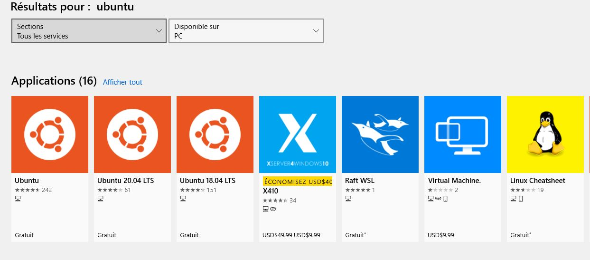
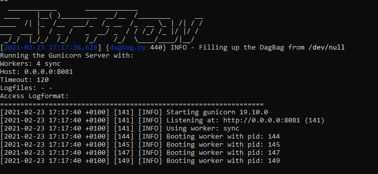
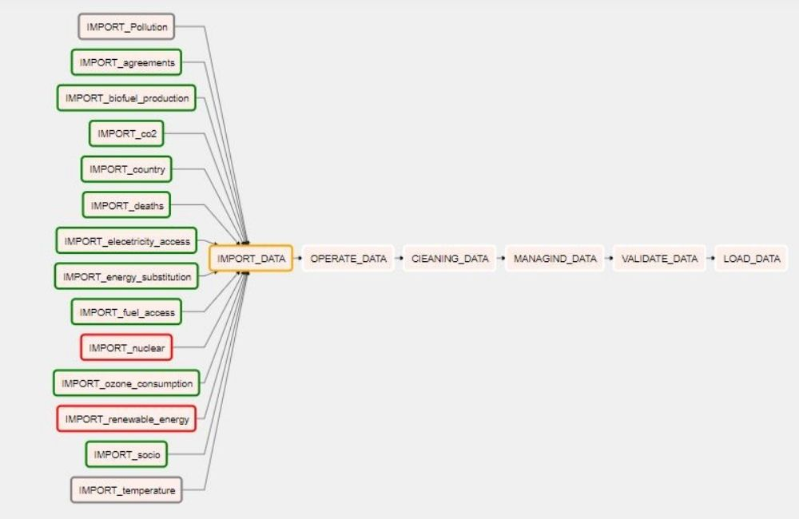
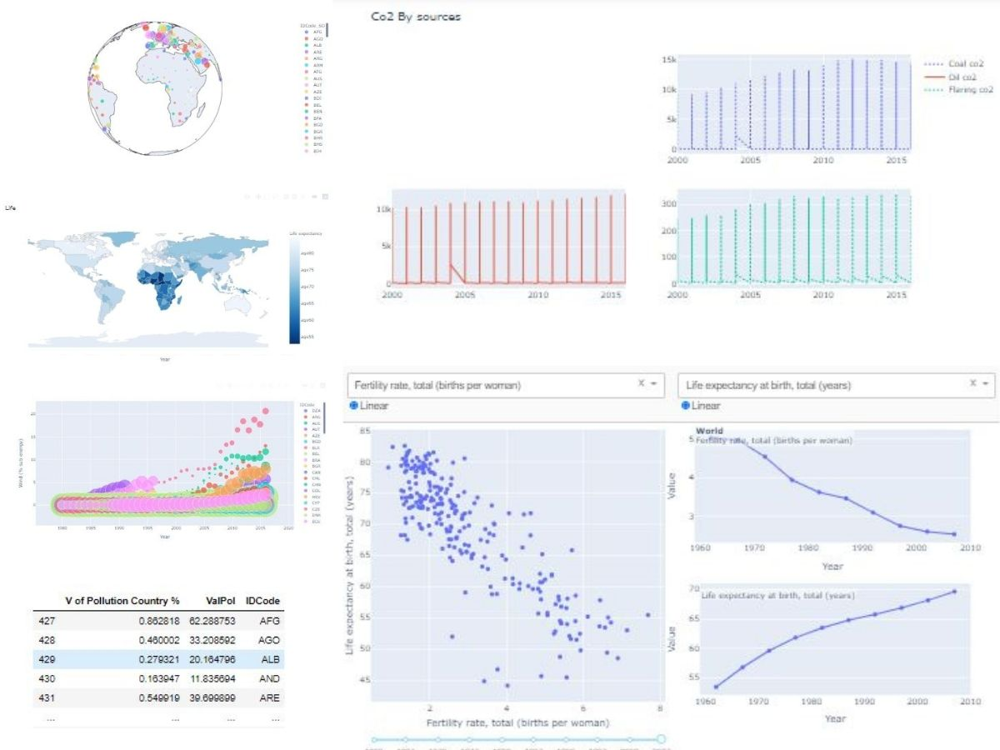

# BUSINESS INTELLIGENCE AND DATA WAREHOUSE

> Climate change, pollution and energy depletion: The world is facing many important and frightening problems. It is on these major issues that my work in this study focuses.


## Table of contents
* [General info](#general-info)
* [Introduction](#introduction) 
* [States of the art](#states-of-the-art)
* [Dataset](#dataset)
* [Selected indicat](#selected-indicat)
* [Technologies and Tools](#technologies-and-tools)
* [Building models](#building-models)
* [Process](#process)
* [Data reproduction](#data-reproduction)
* [Contact](#contact)

## General info

To help companies make more datadriven decisions, there are two distinct
streams of technology intelligence and
buiness intelligence that integrate
business analysis, data mining, data
visualization, data resources and
infrastructure.
In fact, when you have a broad
understanding of an organization's
data and use that data to accelerate
improvements, remove inefficiencies,
and respond quickly to changes in
demand or supply, you realize that you
have modern business intelligence.
So Business Intelligence, more
commonly referred to as BI, is the term
used to describe business intelligence
that enables users, most often
executives or managers, to analyze
their business and draw conclusions in
order to better manage it.

## Introduction
Climate change refers to global
warming. For many decades, this
problem has become a scourge in the
consciousness of humanity, which has
to face this imminent danger by
considering a delicate balance between
meeting short-term needs, such as
achieving annual economic growth and
low unemployment, and long-term
planning, through measures such as
investment in renewable energy and
reforestation, against the impact of
climate change.
Our analysis will therefore aim to
answer a series of questions, if
possible: how can we ensure that the
positive impact of climate change
measures will affect all demographic
categories, especially those most at
risk?

## States of the art

the mission of this project is to realize a
buinesse intelligence approach,
concretization of an etl which allows
the extraction of data from several raw
flat files, then their cleaning, processing
and formatting on relational databases.
thus the preparation of a reporting in
one of the aspects of our subject
"pollution and energies".

## Dataset
* ├── Corporations
* ├── Social Equity
* │ ├── Energy
* │ │ ├── Renewable Energy
* │ │ ├── Fossil Fuels
* │ │ ├── ...
* │ ├── Equity indicators
* │ ├── Government policies and .
. support
* │ ├── Pollution
* │ │ ├── CO₂ and Greenhouse Gas .
. emissions
* │ │ ├── Air Pollution
* │ │ ├── Oil Spills
* │ │ ├── ...


## Technologies and Tools
For most people, open source is rarely
a given and almost never an obligation.
For me, I'm one of the proponents of
open source tools, but I'm too
interested in the philosophy of sharing
and transparency; for these reasons,
we must constantly remind people of
its benefits.
uan ability to be autonomous on the
solution.
possibilities of customization.
improvements made by the
community, which can become global
quite quickly.
a mutualization of maintenance.
no license cost.
ransparency: by exposing the source
code directly on exchange platforms,
companies show technical but also
ethical transparency. They also
reassure the consumer about the
product's functionalities, especially in
terms of privacy.
My approach to business intelligence is
based on open source technologies
* Python 
    * Python is the most widely used open
source programming language used by
computer scientists. This language has
propelled itself to the forefront of
infrastructure management, data
analysis and software development.

* Pandas
    * Pandas is a library written for the
Python programming language
allowing data manipulation and
analysis. In particular, it provides data
structures and operations for
manipulating numerical arrays and
time series. Pandas is free software
under the BSD license.
* Apache airflow
    * Apache Airflow is an open-source
workflow management platform. It has
been launched at Airbnb as a solution
to manage the increasingly complex
workflows of the company.
* Plotly / Dash
    * Dash is a productive Python framework
for building web analytics applications.
Written on Flask, Plotly.js and React.js,
Dash is ideal for building data
visualization applications with highly
customized user interfaces in pure
Python. It is particularly suitable for
anyone working with Python data...


## Building models
### The business objective
General study on the different aspects
of climate change, the impact of energy
production on soil pollution, CO2
concentration, climate policies and
their role in reducing emissions, as well
as the relationship between energy
consumption per country and its
negative impact on air pollution.
In order to study the relationship
between energy consumption per
country and its negative impact on air
pollution. The social equity in energy
and the quantity of different types of
energy used by country.
Mortality rate due to air pollution by
particulate matter and temperature
change for all countries with respect to
the reference year 1965.


## Process
### Achievement of the ETL
#### Extract

the extraction was done on python
using the pandas library which allows
any kind of table manipulation.
 
 
```
import pandas as pd
import glob
import copy
path =r'C:/Users/####/OneDrive/Bureau/Dw Project/DW'
filenames = glob.glob(path + "/*.csv")

dfs = []
for filename in filenames:
    dfs.append(pd.read_csv(filename))
    import re
def idr(data):
    mylist = list(data.columns)
    r = re.compile("ID.*")
    newlist = list(filter(r.match, mylist)) 
    if len(newlist)!=0:
        return newlist[0]
    else:
        pass
ids=[]
for i in dfs:
    ids.append(str(idr(i)))
res = dict(zip(ids, dfs)) 
```

the previous code allows you to select
all the csv files in our directory, then
select the IDs of each table to
automate further processing.

### Transform
#### Cleaning
```
def clearning(datadict):
    temps=0
    framesofid=pd.DataFrame()
    data=[]
    for k,v in datadict.items():
        v.drop_duplicates(inplace=True)
        v.dropna(subset=[str(k)],inplace=True)
        v.sort_values(by=[k], inplace=True)
        if 'Year' in list(v.columns):
            v.drop(v[v.Year < 1980].index, inplace=True)
            v.drop(v[v.Year > 2016 ].index, inplace=True)
        temps+=1
        framesofid[str(k)]=v[str(k)].dropna()
    data.append(framesofid)
    data.append(list(datadict.values()))
    return data
datasets=clearning(res)[1]
idtable=clearning(res)[0]  
```
#### Remodeling of dimensional grids
* Example
```
def DifFuel(data):
    """datasets[0]"""
    temps = data.groupby(['Code','Year']).sum()
    temps['sum']=temps[["Access to clean fuels cooking %"]].sum(axis=1)
    temps=temps['sum']
    tt=temps.reset_index()
    ttmin=tt[(tt['Year'] == min(tt['Year']))]
    ttmax=tt[(tt['Year'] == max(tt['Year']))]
    ttmin=ttmin.rename(columns={"Year": "Ymin", "sum": "Smin"})
    ttmax=ttmax.rename(columns={"Year": "Ymax", "sum": "Smax fuel"})
    tfinal=pd.merge(ttmax, ttmin, on=['Code'])
    tfinal['Relative Change Fuels cooking %'] =((tfinal['Smax fuel']-tfinal['Smin'])/tfinal['Smin'])*100
    tfinal=tfinal[['Code','Relative Change Fuels cooking %','Smax fuel']]
    tfinal=tfinal.rename(columns={"Code": "IDCode","Smax fuel":"Cooking With Fuel %"})
    tfinal.insert(0, 'IDFUELDIF', range(1, 1 + len(tfinal)))
    return tfinal
```
#### Load
for the database, I used the sqlite
database with the sqlite3 library for
python which allows the transfer of
data from other forms to a ".db"
```
def loading():
    final.to_csv('/home/amine/Dw Project/Data/final/facttable.csv')
    df=final
    import sqlite3
    conn = sqlite3.connect('session.db')
    print(conn)

    try:
        conn.execute('DROP TABLE IF EXISTS `Fact` ')
    except Exception as e:
        raise(e)
    finally:
        print('Table dropped')

    try:
        conn.execute('''
         CREATE TABLE Fact ('ID',
         'IDMEANREYY' FLOAT,
         'Deaths - Exposure to forces of nature %' FLOAT,
         'Deaths - Under 5' FLOAT,
         'Deaths -  Age: 5-14 years' FLOAT,
         'Deaths - Age: 15-49 years' FLOAT,
         'Deaths - Age: 50-69 years' FLOAT,
         'Deaths - Age: 70+ years' FLOAT ,
         'Deaths - No access to handwashing facility' FLOAT,
         'Deaths - Smoking' FLOAT,
         'Deaths - Secondhand smoke' FLOAT,
         'Deaths - Unsafe water source' FLOAT,
         'Deaths - Household air pollution from solid fuels' FLOAT,
         'Deaths - Air pollution' FLOAT,
         'Deaths Outdoor air pollution' FLOAT,
         'Year_ID' INT,
         'IDTEMP' INT,
         'AverageTemperature' FLOAT,
         'AverageTemperatureUncertainty' FLOAT,
         'IDEY' INT,
         'sum' FLOAT,
         'IDPRODELECT_x' INT,
         'Global electricity Access %_x' FLOAT,
         'IDPRODFUEL' INT,
         'Global Fuels Access %' FLOAT,
         'IDPRODELECT_y' INT,
         'Global electricity Access %_y' FLOAT,
         'IDMEANREY' INT,
         'Geo Biomass Y %' FLOAT,
         'Hydro Generation Y %' FLOAT,
         'Solar Generation Y %' FLOAT,
         'Wind Generation Y%' FLOAT,
         'IDTYPENY' INT,
         'ValPol' FLOAT,
         'IDPOLVALUE' INT,
         'Prod of Pollution' INT,
         'IDCode' INT,
         'IDTYPENC' INT,
         'IDMEANREC' INT,
         'Consumption Wind Generation %' FLOAT,
         'Consumption Solar Generation %' FLOAT,
         'Consumption Hydro Generation %' FLOAT,
         'Consumption Geo Biomass %' FLOAT,
         'IDMENPV' INT,
         'V of Pollution Country %' FLOAT,
         'IDCO2EMI' INT,
         'CO2 emissions' FLOAT,
         'CO2 emissions %' FLOAT,
         'IDDIFELECT' INT,
         'Relative Change Fuels cooking %' FLOAT,
         'Electricity Access %' FLOAT,
         'IDEC' INT,
         'Consumption ER' FLOAT,
         'IDCONEDIF' INT,
         'Relative Change Consumption %' FLOAT);''')
        print ("Table created successfully");
    except Exception as e:
        print(str(e))
        print('Table Creation Failed!!!!!')
    finally:
        conn.close()
    val_list = df.values.tolist()
    conn = sqlite3.connect('DW.db')
    cur = conn.cursor()
    try:

        cur.executemany("INSERT INTO Fact('ID','IDMEANREYY','Deaths - Exposure to forces of nature %','Deaths - Under 5','Deaths -  Age: 5-14 years','Deaths - Age: 15-49 years','Deaths - Age: 50-69 years','Deaths - Age: 70+ years','Deaths - No access to handwashing facility','Deaths - Smoking','Deaths - Secondhand smoke','Deaths - Unsafe water source','Deaths - Household air pollution from solid fuels','Deaths - Air pollution','Deaths Outdoor air pollution','Year_ID','IDTEMP','AverageTemperature','AverageTemperatureUncertainty','IDEY','sum','IDPRODELECT_x','Global electricity Access %_x','IDPRODFUEL','Global Fuels Access %','IDPRODELECT_y','Global electricity Access %_y','IDMEANREY','Geo Biomass Y %','Hydro Generation Y %','Solar Generation Y %','Wind Generation Y%','IDTYPENY','ValPol','IDPOLVALUE','Prod of Pollution','IDCode','IDTYPENC','IDMEANREC','Consumption Wind Generation %','Consumption Solar Generation %','Consumption Hydro Generation %','Consumption Geo Biomass %','IDMENPV','V of Pollution Country %','IDCO2EMI','CO2 emissions','CO2 emissions %','IDDIFELECT','Relative Change Fuels cooking %','Electricity Access %','IDEC','Consumption ER','IDCONEDIF','Relative Change Consumption %') VALUES (?,?,?,?,?,?,?,?,?,?,?,?,?,?,?,?,?,?,?,?,?,?,?,?,?,?,?,?,?,?,?,?,?,?,?,?,?,?,?,?,?,?,?,?,?,?,?,?,?,?,?,?,?,?,?)", val_list)
        conn.commit()
        print('Data Inserted Successfully')
    except Exception as e:
        print(str(e))
        print('Data Insertion Failed')
    finally:

        conn.close()

```
### ETL Automation

For automation I used the apache airflow
tool which allows to create pipelines,
works flow and so on with python, but it
requires a linux machine.
The solution was the use of a linux
subsystem on windows.


* In Airflow, a DAG -- or directed acyclic
graph -- is a set of all the tasks you want
to perform, organized to reflect their
relationships and dependencies.
A DAG is defined in a Python script,
which represents the structure of the
DAGs (tasks and their dependencies) in
code.
For example, a simple DAG could consist
of three tasks: A, B, and C. It could say
that A must run successfully before B can
run, but that C can run at any time. It
could say that task A stops after 5
minutes and that B can be restarted up to
5 times if it fails. It could also indicate that
the workflow will run every night at 10:00
pm, but should not start before a certain
date.
This is the case of the andtl on will be
based on the logic of the DAG.

* After installing the airflow and python
packages and configuring the
environment, you can access airflow
under the default port 8081.
   * `$airflow webserver -p 8081`

* our ETL will be a bunch of stain and
of dagger chained


## Data reproduction
The management dashboard is a method of evaluating the organization of a company or institution which consists of multiple measures of performance at times particular or over several periods of time. In the field of monitoring economic, the dashboard of management is used in industries to allow you to view the raw data and make them more transparent. usable and understandable, by using for this purpose various visual and various representations forms of prioritization of data. This is an important way to have a vision of the stakes of sound real time operation or deferred. Data aggregation main ones allows to reach the productivity and to make better choice.
My dashboard is a simple example of the graphs we can make from our data entropot. I used both methods to create my graphs, the cloud computing service chart-studio.plotly which makes the task much easier but with limitations of use, it was first the case for other tools like Power BI, Tableau, Kibana etc, which pushed me to work also with the classical method of graph creation based on python codes. 

## Contact
Created by me [Amine KERBOUTE](https://github.com/KERBOUTE)

If you loved what you read here and feel like we can collaborate to produce some exciting stuff, or if you
just want to shoot a question, please feel free to connect with me on <a href="aminekerboute@gmail.com" target="_blank">email</a>, 
<a href="https://www.linkedin.com/in/amine-kerboute/" target="_blank">LinkedIn</a>, or 
<a href="https://twitter.com/KerbouteA" target="_blank">Twitter</a>. 
My other projects can be found [here](https://github.com/KERBOUTE?tab=repositories).

